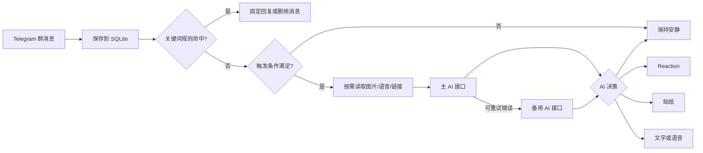

# tg-aibot

<div align="center">

**面向 Telegram 群聊的上下文感知 AI 气氛机器人**

不是逐条抢答的客服机器人，而是会判断什么时候该说话、什么时候只点一个 Reaction、什么时候保持安静的群聊参与者。

[](https://github.com/sanrokamlan-prog/tg-aibot/actions/workflows/ci.yml)
[](https://nodejs.org/)
[](https://docs.docker.com/compose/)
[](https://core.telegram.org/bots/api)
[](LICENSE)

[快速部署](#快速部署) · [能力矩阵](#能力矩阵) · [配置参考](#配置参考) · [管理命令](#管理命令) · [升级与迁移](#升级与迁移) · [安全边界](#安全边界)

</div>

---

tg-aibot 使用 Telegram 长轮询接收群消息，通过 OpenAI 兼容接口完成意图判断与回复生成。它不在服务器本地运行大模型，不需要域名、SSL、反向代理或开放入站端口，适合部署在低配 VPS 上长期运行。

> [!IMPORTANT]
> 机器人要理解普通群消息，必须在 `@BotFather` 中关闭 Privacy Mode。图片理解、语音转写、链接读取和 TTS 默认关闭，确认模型与接口支持后再按需启用。

## 为什么它不像普通聊天机器人

| 场景 | 行为 |
| --- | --- |
| 群友 `@机器人` 或回复机器人 | 必须尝试给出有效回复，并引用原消息 |
| 普通群聊 | 满足冷却、消息间隔和概率后才触发；聊天越密集，插话概率越低 |
| 群聊冷场 | 超过阈值后主动抛出一次话题；同一轮对话不会反复自言自语 |
| 只需要轻量回应 | AI 可以选择 Telegram Reaction 或匹配语境的贴纸 |
| 没有值得回应的内容 | AI 可以选择 `silent`，不发送消息 |
| Telegram Forum Topic | 每个 Topic 独立保存上下文，不会跨话题串线 |
| 安静时段 | 禁止随机插话和冷场复活，但被直接提及时仍然回复 |

AI 每次被触发后只会选择一种动作：

```text
silent   不回应
reaction 给当前消息添加 Reaction
sticker  发送匹配标签的群专属贴纸
reply    发送文字，或在开启后发送 TTS 语音
```

## 能力矩阵

| 模块 | 能力 | 默认状态 |
| --- | --- | --- |
| 上下文 | 群与 Topic 隔离、SQLite 持久化、TTL 自动清理 | 开启 |
| 触发策略 | 被提及、随机插话、冷场复活、自适应概率、安静时段 | 开启 |
| 互动动作 | `silent`、Reaction、贴纸、文字回复 | 开启 |
| 模型路由 | 被提及、随机、冷场可分别指定模型 | 开启 |
| 接口容错 | 请求超时、群级防并发、主备 AI 自动切换 | 开启 |
| 群管理 | Inline 面板、活跃度预设、群级参数持久化 | 开启 |
| 人设 | 全局基础人设 + 每个群最多 30 条附加规则 | 开启 |
| 关键词规则 | 固定回复、删除匹配消息、独立通知冷却 | 开启 |
| 用量 | 24 小时请求量、成功数、字符数和平均延迟 | 开启 |
| 图片理解 | 将触发消息中的图片交给视觉模型 | 关闭 |
| 语音转写 | OpenAI 兼容 `/audio/transcriptions` | 关闭 |
| 链接摘要 | 安全读取首个公网链接，拒绝内网地址 | 关闭 |
| TTS | Edge 免费语音或 OpenAI 兼容 `/audio/speech` | 关闭 |
| 迁移 | 一键导出/恢复 `.env` 与 Docker 数据卷 | 可用 |

## 工作流程



同一个群同一时间只允许一个 AI 请求，不同群仍可并行。媒体文件只会在消息已经触发 AI 后下载，不会扫描群里的每一张图片或每一条语音。

## 运行要求

| 项目 | 最低配置 | 推荐配置 |
| --- | --- | --- |
| CPU | 1 核 | 1 核或以上 |
| 内存 | 512 MB | 1 GB |
| 硬盘 | 5 GB | 10 GB |
| 系统 | 支持 Docker 的 Linux | Ubuntu 22.04+ / Debian 12+ |
| Docker | Docker Engine + Compose v2 | 当前稳定版本 |
| 网络 | 可访问 Telegram 和 AI 接口 | 稳定国际网络 |

机器人只负责调用远程模型接口。单独部署时，`1C1G + 10GB` 足够长期使用。

## 快速部署

### 1. 创建 Telegram Bot

1. 在 Telegram 打开 `@BotFather`，发送 `/newbot`。
2. 按提示设置名称和用户名，保存生成的 `BOT_TOKEN`。
3. 向 `@BotFather` 发送 `/setprivacy`。
4. 选择刚创建的机器人，然后选择 `Disable`。
5. 把机器人加入目标群；如需关键词删除消息，授予删除消息权限。

如果机器人已经在群里，修改 Privacy Mode 后建议将它移出群再重新加入。

### 2. 准备 AI 接口

需要一个 OpenAI 兼容接口，至少包含：

| 配置 | 示例 |
| --- | --- |
| `AI_BASE_URL` | `https://api.example.com/v1` |
| `AI_API_KEY` | `sk-xxxxxx` |
| `AI_MODEL` | `gpt-4o-mini` |

支持常见的 `/chat/completions`，也支持 Responses API。中转站提供完整地址时可以直接使用 `AI_API_URL`。

### 3. 安装 Docker

Ubuntu / Debian 可以使用 Docker 官方安装脚本：

```bash
curl -fsSL https://get.docker.com | sh
sudo systemctl enable --now docker
sudo apt-get update
sudo apt-get install -y git
```

确认 Compose v2 可用：

```bash
docker --version
docker compose version
```

> [!NOTE]
> 快速备份与迁移脚本依赖 `docker compose`，不支持老式 `docker-compose` 命令。

### 4. 下载并配置

```bash
git clone https://github.com/sanrokamlan-prog/tg-aibot.git
cd tg-aibot
```

推荐使用交互式配置：

```bash
docker run --rm -it \
  -v "$PWD:/app" \
  -w /app \
  node:24-alpine \
  node scripts/setup-env.js
```

脚本会校验 Bot Token、API 地址、模型、管理员 ID 和互动参数，然后原子写入 `.env`。如果服务器已经安装 Node.js 24，也可以运行：

```bash
npm run setup
```

手动配置方式：

```bash
cp .env.example .env
nano .env
```

最小可运行配置：

```env
BOT_TOKEN=123456789:AAxxxxxxxxxxxxxxxxxxxx

AI_API_TYPE=chat_completions
AI_BASE_URL=https://api.example.com/v1
AI_API_KEY=sk-xxxxxx
AI_MODEL=gpt-4o-mini

# 建议部署后通过 /chat_id 获取并填写
ALLOWED_CHAT_IDS=-1001234567890

# 可选：Telegram 管理员之外的手动管理白名单
ADMIN_USER_IDS=123456789
```

### 5. 启动并验证

```bash
docker compose up -d --build
docker compose ps
docker compose logs --tail=100
```

看到下面信息说明启动成功：

```text
机器人已启动: @your_bot (123456789)
```

在 Telegram 群里依次发送：

```text
/my_id
/chat_id
/ai_test
/ai_panel
```

`/ai_test` 成功后，再测试 `@机器人 你好`。普通消息不会每条都回复，这是预期行为。

## 推荐起步配置

以下配置适合希望机器人存在感自然、成本可控的普通群聊：

```env
# 控制发给模型的上下文与输出
AI_MAX_CONTEXT_MESSAGES=12
AI_MAX_INPUT_CHARS=1500
AI_MAX_MESSAGE_CHARS=160
AI_MAX_OUTPUT_TOKENS=120
AI_REQUEST_TIMEOUT_MS=30000

# 自然互动
REACTION_ENABLED=true
RANDOM_REPLY_CHANCE=0.05
MIN_REPLY_INTERVAL_SECONDS=60
MIN_MSGS_BETWEEN_REPLIES=3
IDLE_THRESHOLD_MINUTES=20
IDLE_COOLDOWN_MINUTES=60

# 短期记忆
MAX_HISTORY=40
MESSAGE_TTL_HOURS=24
USAGE_TTL_DAYS=30

# 多模态和语音先保持关闭
VISION_ENABLED=false
TRANSCRIPTION_ENABLED=false
LINK_PREVIEW_ENABLED=false
TTS_ENABLED=false
```

机器人还会根据最近两分钟的消息密度调整随机概率；即使配置值较高，实际随机概率也不会超过 `0.5`。

## 配置参考

完整模板见 [.env.example](.env.example)。修改 `.env` 后需要重建或重启容器：

```bash
docker compose up -d --build
```

### Telegram 与访问控制

| 变量 | 默认值 | 说明 |
| --- | --- | --- |
| `BOT_TOKEN` | 必填 | `@BotFather` 生成的机器人 Token |
| `ALLOWED_CHAT_IDS` | 空 | 允许使用机器人的群 ID，逗号分隔；空值表示不限制 |
| `ADMIN_USER_IDS` | 空 | 额外管理员用户 ID，逗号分隔 |
| `TZ` | `Asia/Shanghai` | 容器时区，影响安静时段判断 |

建议先部署，在群里使用 `/chat_id` 和 `/my_id` 取得准确 ID，再写入 `.env`。

### AI 接口与模型路由

| 变量 | 默认值 | 说明 |
| --- | --- | --- |
| `AI_API_TYPE` | `chat_completions` | `chat_completions` 或 `responses` |
| `AI_BASE_URL` | Groq OpenAI 地址 | 主接口基础地址 |
| `AI_API_URL` | 空 | 主接口完整地址；填写后优先于 Base URL |
| `AI_API_KEY` | 必填 | 主接口 API Key |
| `AI_MODEL` | `llama-3.3-70b-versatile` | 默认模型 |
| `AI_MODEL_RANDOM` | 空 | 随机插话专用模型；空值继承默认模型 |
| `AI_MODEL_IDLE` | 空 | 冷场复活专用模型；空值继承默认模型 |
| `AI_REQUEST_TIMEOUT_MS` | `30000` | 单次 AI 请求超时 |
| `AI_DISABLE_RESPONSE_STORAGE` | `true` | Responses API 请求附带 `store: false` |
| `AI_CHAT_TOKEN_FIELD` | `max_tokens` | Chat Completions 的输出 token 字段名 |

群管理员还可以用 `/ai_model mention|random|idle` 覆盖当前群的模型，不影响其他群。

### 备用 AI 接口

```env
AI_FALLBACK_API_TYPE=chat_completions
AI_FALLBACK_BASE_URL=https://backup.example.com/v1
AI_FALLBACK_API_KEY=sk-backup
AI_FALLBACK_MODEL=gpt-4o-mini
```

主接口出现以下情况时会尝试备用接口：

- HTTP `429`
- HTTP `5xx`
- 网络连接错误
- 请求超时
- 图片请求返回 `400`，且备用接口已配置

认证失败等明确不可重试错误不会盲目切换，方便及时发现配置问题。

### 上下文与成本

| 变量 | 默认值 | 说明 |
| --- | --- | --- |
| `AI_MAX_CONTEXT_MESSAGES` | `12` | 单次最多发送给 AI 的最近消息数 |
| `AI_MAX_INPUT_CHARS` | `1500` | 单次群聊记录最大字符数 |
| `AI_MAX_MESSAGE_CHARS` | `160` | 每条消息截断长度 |
| `AI_MAX_OUTPUT_TOKENS` | `120` | 最大输出 token |
| `MAX_HISTORY` | `40` | 每个群/Topic 在 SQLite 中保留的最大消息数 |
| `MESSAGE_TTL_HOURS` | `24` | 短期上下文保留时间 |
| `USAGE_TTL_DAYS` | `30` | AI 用量明细保留时间 |

`MAX_HISTORY` 是本地短期历史上限，真正发送给模型的条数还会受到 `AI_MAX_CONTEXT_MESSAGES` 与字符限制约束。

### 互动策略

| 变量 | 默认值 | 说明 |
| --- | --- | --- |
| `REACTION_ENABLED` | `true` | 允许 AI 使用 Telegram Reaction |
| `RANDOM_REPLY_CHANCE` | `0.05` | 普通消息触发 AI 的基础概率 |
| `MIN_REPLY_INTERVAL_SECONDS` | `60` | 两次主动发言最小间隔 |
| `MIN_MSGS_BETWEEN_REPLIES` | `3` | 再次主动发言前至少经过的群消息数 |
| `IDLE_THRESHOLD_MINUTES` | `20` | 群聊安静多久后考虑复活话题 |
| `IDLE_COOLDOWN_MINUTES` | `60` | 两次冷场复活的最小间隔 |
| `QUIET_HOURS_START` | 空 | 全局安静时段开始，如 `23:00` |
| `QUIET_HOURS_END` | 空 | 全局安静时段结束，如 `08:00` |
| `STICKER_REPLY_CHANCE` | `0.15` | AI 选择贴纸后实际发送的概率 |
| `RULE_COOLDOWN_SECONDS` | `60` | 同一关键词规则的通知冷却 |

这些值是新群默认值。部署后可以通过 `/ai_panel`、`/ai_chance`、`/ai_set` 和 `/quiet` 为每个群独立调整。

### 图片、转写与链接

```env
# 图片理解：当前 AI 模型必须支持视觉输入
VISION_ENABLED=true
VISION_MAX_BYTES=5242880

# 语音转写：兼容 OpenAI /audio/transcriptions
TRANSCRIPTION_ENABLED=true
TRANSCRIPTION_BASE_URL=https://api.example.com/v1
TRANSCRIPTION_API_KEY=sk-xxxxxx
TRANSCRIPTION_MODEL=whisper-1
TRANSCRIPTION_LANGUAGE=zh

# 读取触发消息中的第一个公网链接
LINK_PREVIEW_ENABLED=true
LINK_PREVIEW_MAX_BYTES=524288
```

未单独填写转写地址或 Key 时，会尝试复用主 AI 配置。链接读取会检查 DNS 解析结果和重定向目标，默认拒绝回环、私有和保留地址。

> [!CAUTION]
> 开启多模态后，相应图片、语音转写结果或网页摘要会发送给配置的 AI 服务。启用前应确认群成员知情，并评估所用接口的隐私政策。

### TTS 语音回复

免费 Edge TTS：

```env
TTS_ENABLED=true
TTS_PROVIDER=edge
TTS_EDGE_VOICE=zh-CN-XiaoxiaoNeural
TTS_REPLY_CHANCE=1
```

OpenAI 兼容语音接口：

```env
TTS_ENABLED=true
TTS_PROVIDER=openai
TTS_BASE_URL=https://api.example.com/v1
TTS_API_KEY=sk-xxxxxx
TTS_MODEL=gpt-4o-mini-tts
TTS_OPENAI_VOICE=alloy
TTS_RESPONSE_FORMAT=mp3
TTS_REPLY_CHANCE=1
TTS_TIMEOUT_MS=30000
```

`TTS_ENABLED` 决定尚未保存群配置时的语音默认状态。更稳妥的做法是保持 `false`，再由管理员在需要语音的群发送 `/voice_on`；该命令会覆盖当前群设置。生成语音失败时会自动回退到文字回复。

### SQLite 与数据目录

| 变量 | Docker 默认值 | 说明 |
| --- | --- | --- |
| `DATA_DIR` | `/app/data` | 持久化数据目录 |
| `DATABASE_PATH` | `/app/data/bot.db` | SQLite 数据库路径 |

Docker Compose 使用命名卷 `tg-ai-bot-data` 保存：

- 群配置与模型覆盖
- 每个群/Topic 的短期上下文
- 群贴纸及标签
- 群人设规则
- 关键词规则
- AI 用量统计

SQLite 使用 WAL 模式。容器重建不会删除命名卷；不要使用 `docker compose down -v`，除非明确要删除全部机器人数据。

## 管理命令

### 权限层级

| 权限 | 命令 |
| --- | --- |
| 所有人 | `/my_id` |
| 允许群内成员 | `/chat_id`、`/ai_status`、`/usage`、`/extensions`、`/sticker_id` |
| Telegram 群管理员或 `ADMIN_USER_IDS` | 其余配置、人设、规则和贴纸管理命令 |

`ALLOWED_CHAT_IDS` 配置后，不在名单中的群不会触发 AI，也不能使用群级查询命令。

### 状态与开关

| 命令 | 作用 |
| --- | --- |
| `/my_id` | 查看自己的 Telegram 用户 ID |
| `/chat_id` | 查看当前群 ID 和 Topic ID |
| `/ai_status` | 查看当前群配置、模型、上下文和 24 小时用量 |
| `/ai_test` | 测试当前群 AI 接口并显示模型与 Provider |
| `/ai_on` / `/ai_off` | 开启或关闭当前群 AI 互动 |
| `/voice_on` / `/voice_off` | 开启或关闭当前群 TTS 回复 |
| `/usage` | 查看最近 24 小时请求统计 |
| `/extensions` | 查看已加载扩展模块 |

### 面板与互动参数

```text
/ai_panel
/ai_config
```

Inline 面板可以切换 AI、Reaction、语音，并应用三种预设：

| 预设 | 随机概率 | 主动冷却 | 消息间隔 | 冷场阈值 |
| --- | ---: | ---: | ---: | ---: |
| 安静 | `0.01` | 300 秒 | 8 条 | 60 分钟 |
| 均衡 | `0.03` | 180 秒 | 5 条 | 30 分钟 |
| 活跃 | `0.08` | 60 秒 | 3 条 | 20 分钟 |

精细调整：

```text
/ai_chance 0.05
/ai_set random_chance 0.03
/ai_set min_interval 180
/ai_set min_msgs 5
/ai_set idle_threshold 30
/ai_set idle_cooldown 120
/ai_set sticker_chance 0.15
/ai_set tts_chance 1
/quiet 23:00 08:00
/quiet off
```

`/quiet` 支持跨午夜时段。安静时段只禁止主动互动，不阻止直接提及回复。

### 群级模型路由

```text
/ai_model mention gpt-5-mini
/ai_model random gpt-4o-mini
/ai_model idle default
```

可选模式为 `mention`、`random`、`idle`。模型名使用 `default` 会清除当前群覆盖并恢复 `.env` 路由。

### 群人设

```text
/persona
/persona_add 说话简短一点，像真实群友
/persona_add 偶尔使用广东话，但不要影响理解
/persona_del 2
/persona_clear
```

也可以先发送一条规则说明，再回复该消息发送 `/persona_add`。每个群最多保留 30 条附加规则，每条最多 500 字符。

全局基础人设可以使用 `PERSONA_PROMPT` 覆盖；留空时使用 [src/persona.js](src/persona.js) 内置人设。

### 关键词规则

```text
/rule_add reply 早上好 => 早啊，今天状态怎么样？
/rule_add block 广告链接 => 请不要发广告
/rule_list
/rule_del 3
/rule_clear
```

| 类型 | 行为 |
| --- | --- |
| `reply` | 命中关键词后发送固定回复 |
| `block` | 尝试删除原消息，并按冷却发送提示 |

`block` 每次命中都会尝试删除消息，即使提示仍处于冷却期。机器人必须拥有删除消息权限；规则应尽量精确，避免误删正常内容。

### 群贴纸池

1. 在群里发送一张贴纸。
2. 管理员回复该贴纸：

```text
/sticker_add 开心 赞同
```

常用命令：

| 命令 | 作用 |
| --- | --- |
| `/sticker_id` | 查看被回复贴纸的 `file_id` |
| `/sticker_add 标签...` | 加入当前群贴纸池并附加标签 |
| `/sticker_list` | 查看当前群贴纸池 |
| `/sticker_clear` | 清空当前群贴纸池 |

AI 会根据语境选择贴纸标签，再按当前群的 `sticker_chance` 决定是否实际发送。

也可以在 `.env` 中使用 `STICKER_IDS` 配置逗号分隔的全局贴纸池，作为所有群的后备选择。群内 `/sticker_add` 支持标签匹配，更适合作为主要配置方式。

## 升级与迁移

### 从 1.x 原地升级到 2.0

2.0 继续使用原命名卷 `tg-ai-bot-data`。首次启动会自动将旧版 `chat-config.json` 和 `stickers.json` 导入 SQLite，旧 JSON 文件保留不删。

```bash
cd ~/tg-aibot

# 服务器有本地修改时先处理，不要强行覆盖
git status

git pull

# 使用旧数据和现有 .env 生成一致备份
sh scripts/migrate.sh export "$HOME/tg-aibot-pre-v2.tar.gz"

docker compose up -d --build
docker compose logs --tail=100 -f
```

首次启动日志可能出现：

```text
已导入旧数据: 群配置 1，贴纸 5
机器人已启动: @your_bot (123456789)
```

旧版 `.env` 可以直接继续使用。缺少的 2.0 配置会采用代码默认值，多模态和 TTS 不会自动开启。

### 日常更新

```bash
cd ~/tg-aibot
git pull
docker compose up -d --build
docker compose logs --tail=100
```

不要使用 `docker compose down -v`，否则会连同 SQLite、贴纸、规则和群配置一起删除。

### 迁移到新服务器

旧服务器导出：

```bash
cd ~/tg-aibot
sh scripts/migrate.sh export
```

脚本会短暂停止机器人，复制一致的 `.env` 和 `/app/data`，然后恢复原运行状态。默认生成：

```text
tg-aibot-backup-YYYYMMDD-HHMMSS.tar.gz
```

将备份文件通过可信通道传到新服务器，然后：

```bash
git clone https://github.com/sanrokamlan-prog/tg-aibot.git
cd tg-aibot
sh scripts/migrate.sh import /path/to/tg-aibot-backup.tar.gz
```

目标目录已经存在 `.env` 时，必须显式允许覆盖：

```bash
sh scripts/migrate.sh import /path/to/tg-aibot-backup.tar.gz --force
```

导入前会校验压缩包文件清单和路径，拒绝未知文件及目录穿越路径。备份文件权限默认为 `600`。

> [!WARNING]
> 迁移包包含 `BOT_TOKEN`、`AI_API_KEY` 和完整机器人数据。不要上传到 GitHub、公开网盘或聊天群；迁移完成后及时删除。

## 运维

### 常用操作

```bash
# 查看容器状态
docker compose ps

# 跟踪日志
docker compose logs -f

# 查看最近 200 行
docker compose logs --tail=200

# 重启
docker compose restart

# 停止但保留数据
docker compose down

# 重新构建
docker compose up -d --build
```

### 运行时保护

Docker Compose 默认启用：

- 只读容器根文件系统
- `/tmp` 独立内存文件系统与容量限制
- `no-new-privileges`
- PID 1 init 进程
- 20 秒优雅停止时间
- 单文件 10 MB、最多 3 个日志文件轮转
- `/app/data` 独立持久化命名卷

机器人没有 HTTP 管理端口，不会向公网监听服务。

## 故障排查

| 现象 | 优先检查 |
| --- | --- |
| 容器不断重启 | `docker compose logs --tail=200`，检查 `BOT_TOKEN` 与 `.env` 格式 |
| 普通消息完全看不到 | `@BotFather` 的 `/setprivacy` 是否为 `Disable`，修改后重新入群 |
| 被 `@` 也不回复 | `/ai_test`，检查 Base URL、Key、模型、余额和网络 |
| 管理命令提示无权限 | 使用 `/my_id`，确认 Telegram 管理员状态或 `ADMIN_USER_IDS` |
| 出现 `401/403` | API Key、模型权限、接口类型或完整 API URL |
| 出现 `429` | 降低互动频率、缩短上下文、配置备用接口或检查额度 |
| 图片无法理解 | `VISION_ENABLED` 与当前模型视觉能力 |
| 语音转写失败 | 转写地址、Key、模型、文件大小和接口兼容性 |
| TTS 只发文字 | 群内 `/voice_on`、Provider 配置、语音接口响应和容器日志 |
| 关键词无法删除消息 | 机器人是否拥有群管理中的删除消息权限 |
| 更新后旧配置没导入 | 数据卷是否仍为 `tg-ai-bot-data`，日志是否出现 JSON 解析错误 |

快速检查：

```bash
docker compose config
docker compose ps
docker compose logs --tail=200
```

## 安全边界

### 已有保护

- `ALLOWED_CHAT_IDS` 可以限制机器人只服务指定群。
- 管理操作要求 Telegram 群管理员或手动管理员白名单。
- AI 请求有超时，同群请求有并发锁并在 `finally` 中释放。
- 链接读取默认拒绝回环、私有和保留地址，并重新验证重定向目标。
- 媒体下载和链接正文设置大小上限与超时。
- SQLite 使用事务迁移，旧 JSON 自动导入但不会删除。
- 迁移导入校验压缩包路径和允许文件清单。
- `.env`、数据库和迁移备份都不会进入 Git 版本控制。

### 部署者仍需负责

- 不要公开 `.env`、`BOT_TOKEN`、API Key 或迁移压缩包。
- Token 泄露后使用 `@BotFather /revoke`，API Key 泄露后立即撤销。
- 群聊上下文会发送给配置的 AI 服务；应让群成员知道机器人存在。
- 开启图片、转写和链接能力后，对应内容也会发送给 AI 服务。
- 关键词 `block` 规则不是完整内容审核系统，启用前应验证误删风险。
- `ALLOWED_CHAT_IDS` 留空代表不限制群；长期自用部署建议明确填写。
- 主机系统、Docker、云防火墙和 SSH 安全不属于本项目管理范围。

## 数据与隐私

机器人保存的是带 TTL 的短期上下文，不是永久群记忆：

- 默认每个群/Topic 最多 40 条消息
- 默认消息最多保留 24 小时
- 默认 AI 用量明细保留 30 天
- 不提供长期群摘要或无限期历史检索
- 删除 Docker 数据卷会永久删除全部机器人数据

需要检查数据卷时：

```bash
docker volume ls | grep tg-ai-bot
docker compose run --rm --no-deps --entrypoint sh tg-ai-bot -c 'ls -lah /app/data'
```

## 项目结构

```text
tg-aibot/
├── src/
│   ├── index.js               启动与生命周期
│   ├── interactionService.js  消息触发和动作发送
│   ├── ai.js                  模型请求、路由与主备切换
│   ├── commands.js            群管理命令和 Inline 面板
│   ├── database.js            SQLite Schema 与旧数据导入
│   ├── contextStore.js        Topic 上下文与 TTL
│   ├── mediaContext.js        图片、转写和链接上下文
│   ├── tts.js                 Edge/OpenAI 语音生成
│   └── extensions/            消息扩展模块
├── scripts/
│   ├── setup-env.js           交互式配置
│   └── migrate.sh             备份与跨服务器迁移
├── test/                      Node.js 行为测试
├── docker-compose.yml
├── Dockerfile
└── .env.example
```

## 开发与验证

本地需要 Node.js 24.15 或更高版本：

```bash
npm ci
npm test
npm audit --omit=dev
```

额外检查：

```bash
node --check src/index.js
sh -n scripts/migrate.sh
docker build -t tg-aibot:test .
```

GitHub Actions 会在 `main` 推送和 Pull Request 时执行：

1. `npm ci`
2. `npm test`
3. 迁移脚本语法检查
4. Docker 镜像构建

当前测试覆盖 AI 请求超时、群级防并发、SQLite 旧数据迁移、四种互动动作、直接提及、冷场单次触发、关键词删除、多模态辅助函数、TTS、Reaction 和 Topic 交互链路。

## 适用范围

适合：

- 希望机器人像普通群友一样低频参与讨论
- 需要多个群或 Forum Topic 隔离上下文
- 希望按群调整人设、模型、活跃程度和规则
- 使用 OpenAI、Groq 或 OpenAI 兼容中转站
- 希望用 Docker 在低配 VPS 上长期自托管

不适合：

- 要求每条消息必答的客服机器人
- 需要无限期知识记忆或群聊归档系统
- 需要强一致内容审核或反垃圾平台
- 希望在本机离线运行大模型
- 需要 Web 管理后台或多租户 SaaS

## License

本项目使用 [MIT License](LICENSE)。你可以自由使用、修改和分发，但需要保留许可证与版权声明。

---

部署完成后先执行 `/ai_test`，再调整活跃度；让机器人少说但说对，通常比提高回复频率更自然。
